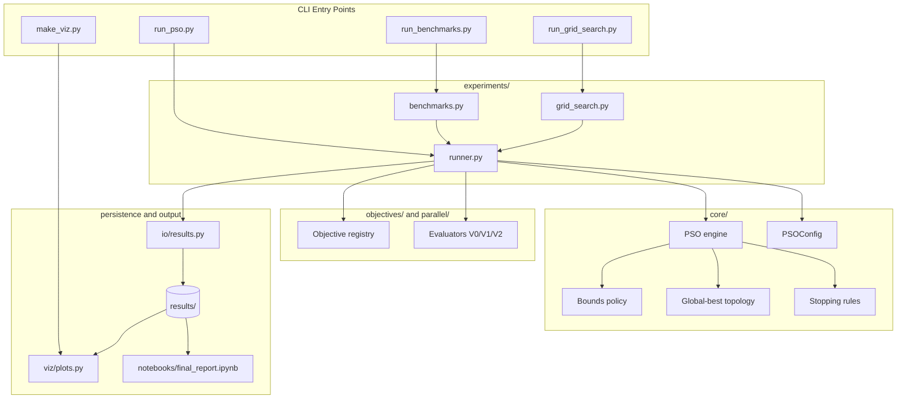

# PSO Lab

Particle Swarm Optimization (PSO) project tailored for Linux/WSL, with one
shared core and three comparable execution variants:

- `V0`: sequential
- `V1`: thread-based concurrency
- `V2`: process-based parallelism

The repository keeps a single implementation of the algorithm and swaps only
the fitness-evaluation strategy. The only supported topology is `global-best`,
which matches the simplified delivery scope.

Repository URL: `https://github.com/Lscotti-uni/PSO-python`

## Repository Layout

| Path | Purpose |
| --- | --- |
| `docs/architecture.md` | Architecture overview and module dependency diagram |
| `configs/` | YAML configuration for single runs, benchmarks, and grid search |
| `docs/design.md` | Short design document with architecture and trade-offs |
| `notebooks/final_report.ipynb` | Narrated experimental report and analysis notebook |
| `results/` | Saved artifacts for runs, benchmarks, grid search, and visualizations |
| `scripts/` | Reproducible entry points required by the assignment |
| `src/pso_lab/` | Project source code |
| `tests/` | Unit tests for correctness and reproducibility |
| `requirements.txt` | Runtime and validation dependencies |
| `pyproject.toml` | Packaging metadata |

## Installation On Linux / WSL

```bash
cd /path/to/project
python3 -m venv .venv
source .venv/bin/activate
pip install -r requirements.txt
pip install -e .
```

The requirements file also includes the notebook runtime so
`notebooks/final_report.ipynb` can be executed without extra setup.

## Architecture



Main design decisions:

- One shared PSO core to avoid duplicated logic.
- `clamp` and `reflect` as explicit boundary policies.
- Fixed `global-best` topology.
- YAML-based configuration with CLI overrides.
- Objective bounds are defined in YAML instead of being hardcoded in scripts.
- Early stopping stays available for single runs, but benchmarks and grid
  search use fixed iteration budgets for fair comparisons.
- Persistence through `JSON`, `CSV`, and `NPZ`.

For a dedicated architecture handoff document, see
`docs/architecture.md`.

## Implemented Functionality

- Continuous minimization in arbitrary dimension.
- Per-dimension box constraints through explicit boundary policies.
- Standard benchmarks: `Sphere`, `Rosenbrock`, `Rastrigin`, `Ackley`.
- Reproducible benchmark dimensions such as `2`, `10`, and `30`.
- Structured logging and per-iteration instrumentation.
- Configurable grid search over `w`, `c1`, `c2`, swarm size, and iterations
  across `V0`, `V1`, and `V2`.
- 2D and 3D visualization with convergence plots and swarm animations.
- Structured persistence with seed, commit hash, and system metadata.

## Required Scripts

- `scripts/run_pso.py`: single run.
- `scripts/run_benchmarks.py`: benchmark suite.
- `scripts/run_grid_search.py`: reproducible grid search.
- `scripts/make_viz.py`: plots and animations from saved runs.

## Parallel Strategies

| Variant | Backend | Intended lesson | Expected trade-off |
| --- | --- | --- | --- |
| `V0` | Sequential evaluation | Reference baseline | No parallel overhead, but no concurrency |
| `V1` | `ThreadPoolExecutor` | Show the impact of threads under the GIL | Cheap orchestration, but CPU-bound code may not speed up |
| `V2` | `ProcessPoolExecutor` | Show true parallel evaluation for heavier workloads | Better CPU scaling, but higher IPC and serialization cost |

The core PSO implementation is shared across all variants. Only the
fitness-evaluation strategy changes, which keeps optimization quality
comparable while exposing timing differences.

`V2` also supports batching through the `batch_size` parameter so process-based
evaluation does not submit one particle per task unnecessarily.

## Logging And Observability

Each run records:

- total runtime
- fitness-evaluation time
- particle-update time
- estimated parallel overhead
- best fitness per iteration
- convergence-related metrics

Structured logs are written to `run.log`, while machine-readable artifacts are
stored in `summary.json`, `history.csv`, and optionally `trajectory.npz`.

## Reproducing Results

| Goal | Command |
| --- | --- |
| Run unit tests | `python3 -m pytest -q` |
| Single PSO run | `python3 scripts/run_pso.py --config configs/pso.yaml` |
| Benchmark suite | `python3 scripts/run_benchmarks.py --config configs/benchmark.yaml` |
| Grid search across strategies | `python3 scripts/run_grid_search.py --config configs/grid_search.yaml` |
| Create visualization | `python3 scripts/make_viz.py --run-dir results/runs/<run_id> --gif` |
| Open the narrated report notebook | `jupyter notebook notebooks/final_report.ipynb` |

For fair comparisons, benchmarks and grid search run with fixed iteration
budgets. Single runs can still use early stopping.

## Usage Examples

Single run:

```bash
python scripts/run_pso.py --config configs/pso.yaml --objective sphere --dim 10 --seed 123
```

Benchmark suite:

```bash
python scripts/run_benchmarks.py --config configs/benchmark.yaml
```

Grid search:

```bash
python scripts/run_grid_search.py --config configs/grid_search.yaml --top-n 10
```

Visualization:

```bash
python scripts/run_pso.py --config configs/pso.yaml --objective sphere --dim 2 --track-trajectory
python scripts/make_viz.py --run-dir results/runs/<run_id> --gif
```

If the run dimension is not `2` or `3`, `make_viz.py` still generates
`convergence.png`, but it skips swarm animation frames.

## Persistence

Each individual run stores:

- `summary.json`: configuration, seed, commit, system, and final metrics.
- `history.csv`: per-iteration metrics.
- `trajectory.npz`: compressed trajectory, when enabled.
- `run.log`: structured logging output.

The `results/` directory is intentionally reduced to:

- `results/benchmarks`
- `results/grid_search`
- `results/runs`
- `results/visualizations`

The full `results/` directory is generated automatically by the scripts and is
not versioned by default. This keeps the repository lightweight because full
benchmark and grid-search outputs can become very large.

## Analysis Notebook

Post-run analysis is centralized in:

- `notebooks/final_report.ipynb`

The notebook builds the Cartesian product of experimental cases, loads the
saved artifacts, and produces summary tables, convergence plots, boxplots, and
speedup comparisons.

## Tests

```bash
pytest
```

The current test suite covers:

- seed reproducibility
- boundary handling
- monotonic global-best behavior
- convergence on Sphere
- evaluator consistency across V0, V1, and V2
