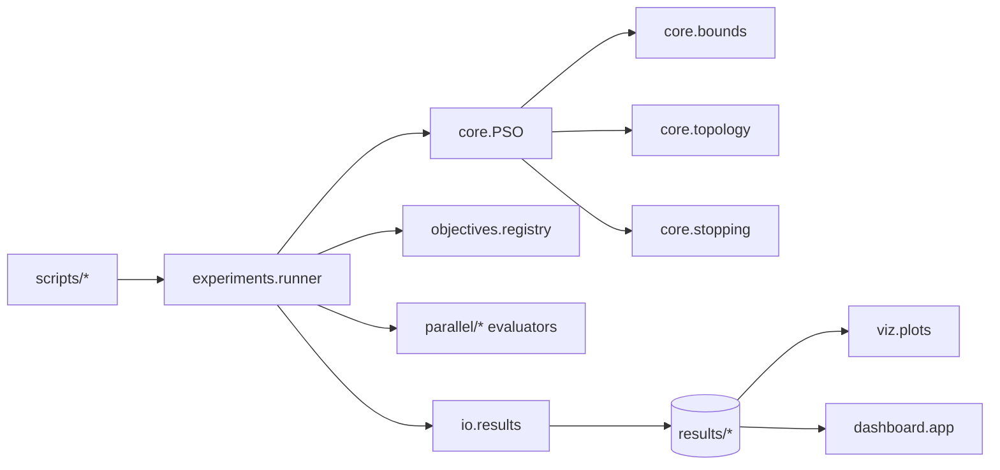

# PSO Lab

Laboratorio de Particle Swarm Optimization (PSO) en Python con foco en:

- arquitectura mantenible
- comparacion entre estrategias secuenciales, concurrentes y paralelas
- instrumentacion y persistencia
- benchmarks, grid search y visualizacion
- analisis local con dashboard

## Estructura

```text
.
|-- configs/
|-- docs/
|-- results/
|-- scripts/
|-- src/pso_lab/
|   |-- core/
|   |-- dashboard/
|   |-- experiments/
|   |-- io/
|   |-- objectives/
|   |-- parallel/
|   |-- utils/
|   `-- viz/
`-- tests/
```

## Instalacion

```bash
pip install -e .
```

Para desarrollo:

```bash
pip install -e .[dev]
```

## Arquitectura



El proyecto mantiene un unico motor PSO y cambia solo las piezas
intercambiables:

- estrategia de evaluacion
- modo de actualizacion
- politica de limites
- topologia social

La politica de limites por defecto es `clamp`. Tambien se incluye `reflect`.
La topologia minima es `global-best` y se anade `ring` como variante local.

## Estrategias Implementadas

| Variante | Evaluacion | Actualizacion | Uso esperado |
|---|---|---|---|
| `V0` | secuencial | bucles Python | baseline |
| `V1` | `ThreadPoolExecutor` | bucles Python | evaluar impacto del GIL |
| `V2` | `ProcessPoolExecutor` + batching | bucles Python | CPU-bound mas pesado |
| `V3` | `asyncio.gather` | bucles Python | escenarios con latencia |
| `V4` | NumPy vectorizado | NumPy vectorizado | paralelismo implicito |
| `V5` | `joblib.Parallel` con `loky` | bucles Python | framework de mas alto nivel para procesos y batching |

Notas sobre `V5`:

- por defecto usa `joblib_backend = loky`
- se apoya en la misma API comun de evaluacion que el resto
- en entornos restringidos puede usarse `threading` como fallback de depuracion

## Scripts Principales

| Script | Uso |
|---|---|
| `scripts/run_pso.py` | Ejecuta una corrida individual |
| `scripts/run_benchmarks.py` | Lanza la suite de benchmarks |
| `scripts/run_grid_search.py` | Ejecuta rejilla de hiperparametros |
| `scripts/make_viz.py` | Genera plots y frames o GIF de una corrida |
| `scripts/analyze_results.py` | Resume resultados ya guardados |
| `scripts/run_dashboard.py` | Abre el dashboard local en Gradio |
| `scripts/run_full_protocol.py` | Ejecuta el protocolo experimental completo |

## Ejemplos De Uso

Corrida individual:

```bash
python scripts/run_pso.py --objective sphere --dim 10 --iters 200 --seed 123
```

Version vectorizada:

```bash
python scripts/run_pso.py --strategy vectorized --update-mode vectorized
```

Version `V5` con joblib:

```bash
python scripts/run_pso.py --strategy joblib --workers 4
```

Version `V5` con backend alternativo:

```bash
python scripts/run_pso.py --strategy joblib --workers 4 --joblib-backend threading
```

Benchmark reducido:

```bash
python scripts/run_benchmarks.py --config configs/benchmark_suite.yaml --max-cases 8
```

Grid search reducido:

```bash
python scripts/run_grid_search.py --config configs/grid_search.yaml --max-configs 5
```

Visualizacion de una corrida guardada:

```bash
python scripts/make_viz.py --run-dir results/runs/<run_id> --gif
```

Notas sobre visualizacion:

- para animar el enjambre, la corrida original debe haberse ejecutado con
  `--track-trajectory`
- la animacion espacial del enjambre solo esta soportada para `d=2` o `d=3`
- si la corrida tiene `d>3`, `make_viz.py` genera `convergence.png` y muestra
  un aviso en lugar de fallar

Analisis de resultados:

```bash
python scripts/analyze_results.py --results-root results
```

Dashboard local:

```bash
python scripts/run_dashboard.py --results-root results
```

Protocolo completo:

```bash
python scripts/run_full_protocol.py --config configs/protocol_full.yaml
```

## Persistencia

Cada ejecucion guarda:

- `summary.json`: configuracion, commit, hardware y metricas finales
- `history.csv`: metricas por iteracion
- `trajectory.npz`: trayectorias comprimidas cuando se habilita
- `run.log`: logging estructurado

Se eligio:

- `JSON` para metadatos jerarquicos
- `CSV` para series temporales faciles de abrir
- `NPZ` para datos numericos comprimidos

## Configuracion Y Reproducibilidad

- todas las corridas aceptan `seed`
- el commit Git y datos basicos de hardware se guardan automaticamente
- los experimentos se pueden lanzar desde YAML y sobreescribir por CLI
- `V5` se controla con `strategy = joblib`, `workers`, `batch_size` y `joblib_backend`
- `trajectory.npz` solo aparece si activas `track_trajectory`

## Tests

```bash
pytest
```

Los tests cubren:

- reproducibilidad por semilla
- politicas de limites
- monotonicidad del mejor global
- convergencia basica en Sphere
- validez del registro de objetivos
- consistencia basica del evaluador `V5`

## Documentacion

- `docs/final_report.md`: informe experimental detallado

En la version que se suba a GitHub, el documento de `docs/` que se conservara
sera `docs/final_report.md`. El resto de notas y documentos de estudio se
mantienen como material local personal.

## GitHub Y Artefactos

El repo ya esta preparado para publicacion futura, pero todavia no se ha hecho
`push`.

Por defecto se ignoran:

- `results/**`
- `docs/**` excepto `docs/final_report.md`
- `docs/*.pdf`

La idea es versionar el codigo y la documentacion en Markdown, y dejar los
artefactos generados como resultados locales regenerables.

Para cumplir la consigna sin inflar el repositorio, se versiona tambien un
subconjunto pequeno y representativo de resultados en `results/examples/`.

Ejemplos incluidos en GitHub:

- `results/examples/single_run/summary.json`
- `results/examples/single_run/history.csv`
- `results/examples/single_run/convergence.png`
- `results/examples/benchmarks/benchmark_summary.csv`
- `results/examples/benchmarks/benchmark_summary.json`
- `results/examples/analysis/*.png`

## Presentacion

Para una demo clara suele funcionar bien este flujo:

1. Ejecutar una corrida `V0`, una `V4` y una `V5`.
2. Lanzar un benchmark reducido y mostrar la tabla resumen.
3. Enseñar un `summary.json` y el `history.csv`.
4. Abrir el GIF o frames de una corrida en 2D.
5. Cerrar con `docs/final_report.md`.
