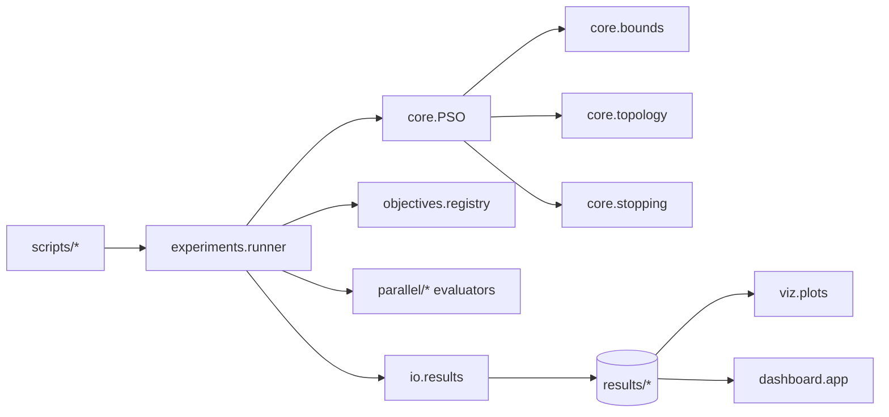

# PSO Lab

Python laboratory for Particle Swarm Optimization (PSO) with emphasis on:

- maintainable architecture
- comparison of sequential, concurrent, and parallel execution strategies
- instrumentation and persistence
- benchmark suites, grid search, and visualization
- local analysis through a dashboard

## Structure

```text
.
|-- configs/
|-- docs/
|-- results/
|-- scripts/
|-- src/pso_lab/
|   |-- core/
|   |-- dashboard/
|   |-- experiments/
|   |-- io/
|   |-- objectives/
|   |-- parallel/
|   |-- utils/
|   `-- viz/
`-- tests/
```

## Installation

```bash
pip install -e .
```

For development:

```bash
pip install -e .[dev]
```

## Architecture



The project keeps a single PSO core and swaps only interchangeable components:

- evaluation strategy
- update mode
- boundary policy
- social topology

The default boundary policy is `clamp`, with `reflect` available as an
alternative. The baseline topology is `global-best`, and `ring` is included as
a local topology variant.

## Implemented Strategies

| Variant | Evaluation | Update | Expected use |
|---|---|---|---|
| `V0` | sequential | Python loops | baseline |
| `V1` | `ThreadPoolExecutor` | Python loops | illustrate GIL impact |
| `V2` | `ProcessPoolExecutor` with batching | Python loops | heavier CPU-bound evaluation |
| `V3` | `asyncio.gather` | Python loops | latency-oriented scenarios |
| `V4` | NumPy vectorized | NumPy vectorized | implicit parallelism |
| `V5` | `joblib.Parallel` with `loky` | Python loops | higher-level process-style backend |

Notes about `V5`:

- the default backend is `joblib_backend = loky`
- it uses the same common evaluation API as the other strategies
- `threading` can be used as a fallback backend in restricted environments

## Main Scripts

| Script | Purpose |
|---|---|
| `scripts/run_pso.py` | Execute a single PSO run |
| `scripts/run_benchmarks.py` | Execute the benchmark suite |
| `scripts/run_grid_search.py` | Execute hyperparameter grid search |
| `scripts/make_viz.py` | Generate plots and frames or GIFs from a saved run |
| `scripts/analyze_results.py` | Summarize previously saved results |
| `scripts/run_dashboard.py` | Launch the local Gradio dashboard |
| `scripts/run_full_protocol.py` | Execute the full experimental protocol |

## Usage Examples

Single run:

```bash
python scripts/run_pso.py --objective sphere --dim 10 --iters 200 --seed 123
```

Vectorized variant:

```bash
python scripts/run_pso.py --strategy vectorized --update-mode vectorized
```

`V5` with joblib:

```bash
python scripts/run_pso.py --strategy joblib --workers 4
```

`V5` with an alternative backend:

```bash
python scripts/run_pso.py --strategy joblib --workers 4 --joblib-backend threading
```

Reduced benchmark suite:

```bash
python scripts/run_benchmarks.py --config configs/benchmark_suite.yaml --max-cases 8
```

Reduced grid search:

```bash
python scripts/run_grid_search.py --config configs/grid_search.yaml --max-configs 5
```

Visualization for a saved run:

```bash
python scripts/make_viz.py --run-dir results/runs/<run_id> --gif
```

Visualization notes:

- to animate the swarm, the original run must be executed with
  `--track-trajectory`
- spatial swarm animation is supported only for `d=2` or `d=3`
- for `d>3`, `make_viz.py` generates `convergence.png` and prints a warning
  instead of failing

Result analysis:

```bash
python scripts/analyze_results.py --results-root results
```

Local dashboard:

```bash
python scripts/run_dashboard.py --results-root results
```

Full protocol:

```bash
python scripts/run_full_protocol.py --config configs/protocol_full.yaml
```

## Persistence

Each run stores:

- `summary.json`: configuration, commit, hardware, and final metrics
- `history.csv`: per-iteration metrics
- `trajectory.npz`: compressed trajectories when enabled
- `run.log`: structured logging

Chosen formats:

- `JSON` for hierarchical metadata
- `CSV` for time series that are easy to inspect
- `NPZ` for compressed numeric arrays

## Configuration And Reproducibility

- every run accepts a `seed`
- Git commit information and basic hardware metadata are stored automatically
- experiments can be launched from YAML and overridden from the CLI
- `V5` is controlled through `strategy = joblib`, `workers`, `batch_size`, and
  `joblib_backend`
- `trajectory.npz` is generated only when `track_trajectory` is enabled

## Tests

```bash
pytest
```

The test suite covers:

- seed reproducibility
- boundary policies
- monotonic global-best evolution
- basic convergence on Sphere
- objective-registry correctness
- basic `V5` evaluator consistency

## Documentation

- `docs/final_report.md`: detailed experimental report

Within `docs/`, the repository tracks only `docs/final_report.md`. Personal
study notes and local PDF exports remain outside version control.

## GitHub And Artifacts

The repository tracks source code, configuration, tests, and a small subset of
result artifacts.

Ignored by default:

- `results/**`
- `docs/**` except `docs/final_report.md`
- `docs/*.pdf`

To satisfy the project requirements without turning the repository into a large
artifact dump, a small representative subset is versioned in `results/examples/`.

Tracked examples:

- `results/examples/single_run/summary.json`
- `results/examples/single_run/history.csv`
- `results/examples/single_run/convergence.png`
- `results/examples/benchmarks/benchmark_summary.csv`
- `results/examples/benchmarks/benchmark_summary.json`
- `results/examples/analysis/*.png`
