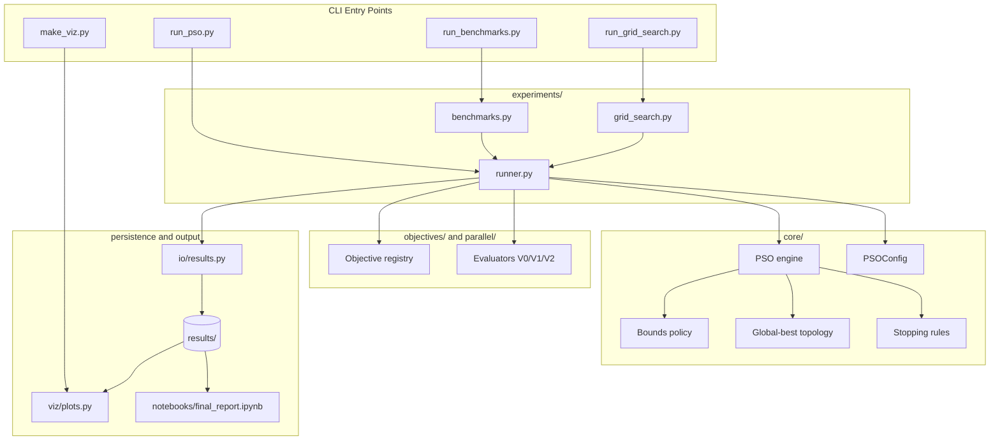

# Architecture Overview

This document focuses on module responsibilities and dependencies in the PSO
project. The design keeps one optimizer core and swaps only the evaluation
backend, which makes the strategy comparison easier to reason about.

## Dependency Diagram

## Module Responsibilities

| Module | Responsibility |
| --- | --- |
| `core/` | PSO state, update rule, stopping criteria, bounds, and topology |
| `objectives/` | Benchmark functions and objective metadata |
| `parallel/` | Sequential, threaded, and process-based evaluators |
| `experiments/` | Single-run orchestration, benchmarks, and grid search |
| `io/` | Persistence of summaries, histories, and trajectories |
| `viz/` | Convergence plots and swarm visualizations |
| `scripts/` | Reproducible command-line entry points |

## Core Abstractions

| Abstraction | Role in the design |
| --- | --- |
| `FitnessEvaluator` | Decouples the PSO engine from the execution backend |
| `BoundsPolicy` | Encapsulates box-constraint handling such as `clamp` and `reflect` |
| `TopologyStrategy` | Encapsulates the social information flow in the swarm |

The current delivery ships one topology implementation, `global-best`, but the
interface remains explicit so the optimizer core does not depend on a hardcoded
social-update mechanism.

## Key Architectural Ideas

- The PSO optimizer is implemented once and reused by every strategy.
- Bound handling is isolated behind a policy interface.
- The topology is also isolated behind an interface, even though the current
  delivery keeps only `global-best`.
- Result persistence is separated from optimization logic so saved runs can be
  analyzed later without rerunning experiments.
