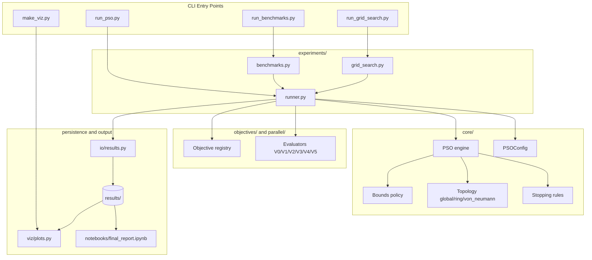

# Architecture Overview

This document focuses on module responsibilities and dependencies in the PSO
project. The design keeps one optimizer core and swaps only the evaluation
backend, which makes the strategy comparison easier to reason about.

## Dependency Diagram

## Module Responsibilities

| Module | Responsibility |
| --- | --- |
| `core/` | PSO state, update rule, stopping criteria, bounds, and topology |
| `objectives/` | Benchmark functions and objective metadata |
| `parallel/` | Six evaluation backends: sequential (V0), threaded (V1), process-based (V2), asyncio (V3), vectorized (V4), joblib (V5) |
| `experiments/` | Single-run orchestration, benchmarks, and grid search |
| `io/` | Persistence of summaries, histories, and trajectories |
| `viz/` | Convergence plots and swarm visualizations |
| `scripts/` | Reproducible command-line entry points |

## Core Abstractions

| Abstraction | Role in the design |
| --- | --- |
| `FitnessEvaluator` | Decouples the PSO engine from the execution backend |
| `BoundsPolicy` | Encapsulates box-constraint handling such as `clamp` and `reflect` |
| `TopologyStrategy` | Encapsulates the social information flow in the swarm |

The current delivery ships three topology implementations — `global`,
`ring`, and `von_neumann` — selectable from configuration without touching
the optimizer core.

## Key Architectural Ideas

- The PSO optimizer is implemented once and reused by every strategy.
- Bound handling is isolated behind a policy interface (`clamp`, `reflect`).
- The topology is isolated behind an interface (`global`, `ring`,
  `von_neumann` ship today).
- The fitness evaluator is also pluggable: six backends (V0-V5) implement
  the same interface so the comparison between sequential, threaded,
  process-based, asyncio, vectorized, and joblib execution is fair.
- Result persistence is separated from optimization logic so saved runs can
  be analyzed later without rerunning experiments.
