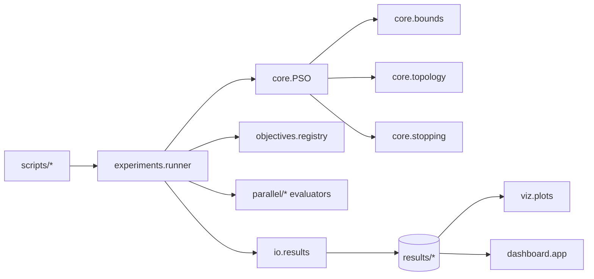
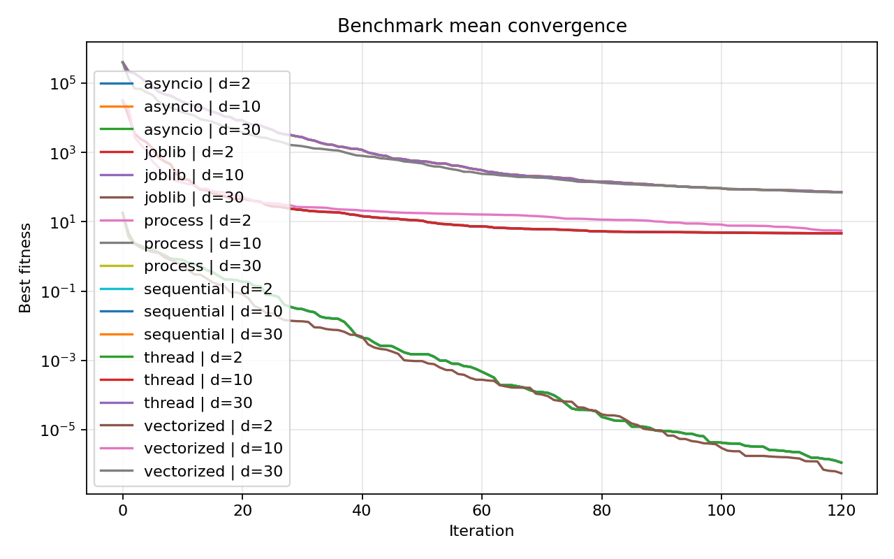
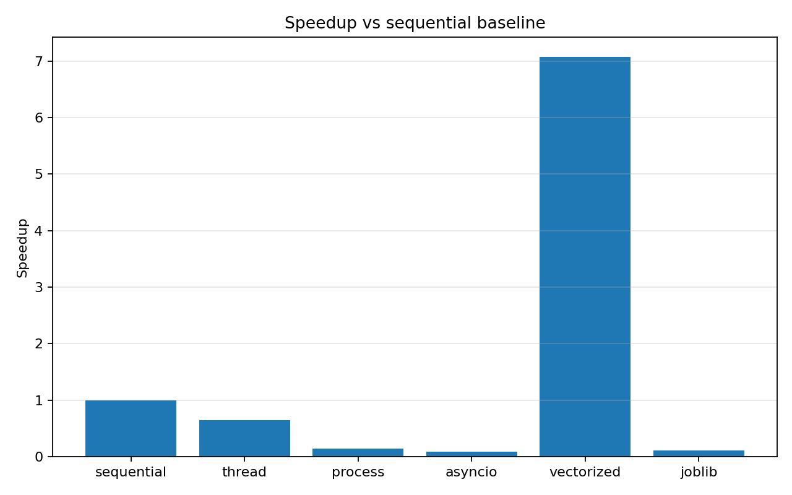
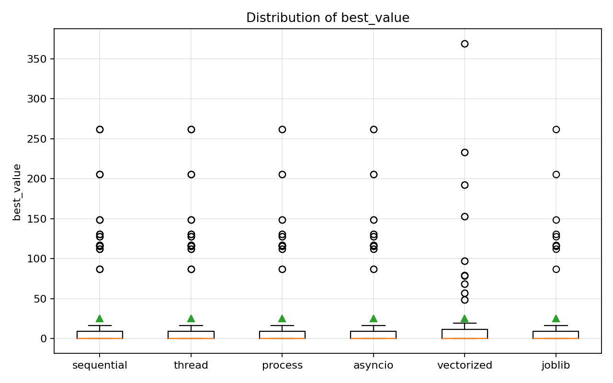

# Informe Final: Laboratorio PSO

## 1. Resumen Ejecutivo

Este proyecto implementa un laboratorio completo de Particle Swarm Optimization (PSO) en Python con foco en arquitectura mantenible, observabilidad y comparacion experimental entre estrategias de ejecucion secuencial, concurrente y paralela.

El core del algoritmo se mantiene comun para todas las variantes. La diferencia entre versiones se concentra en la estrategia de evaluacion de fitness y en el modo de actualizacion, lo que evita mantener varias implementaciones disjuntas del PSO y hace la comparacion mucho mas justa.

El protocolo experimental guardado en `results/protocol_full` incluye:

- benchmarks sobre `Sphere`, `Rosenbrock`, `Rastrigin` y `Ackley`
- dimensiones `2`, `10` y `30`
- cinco semillas reproducibles por caso
- variantes `V0` a `V5`
- grid search reducido `3x3x3` sobre `w`, `c1` y `c2` para cada variante
- persistencia estructurada de metricas, logs, resumenes y trayectorias

Conclusiones ejecutivas:

- La variante mas rapida del estudio fue `V4` en dimension `2`, con tiempo medio `0.0165` s.
- La variante mas lenta fue `V3` en dimension `10`, lo que confirma el peso del overhead cuando el trabajo por tarea es pequeno.
- La mejor calidad media global la obtuvo `V4` con fitness medio `25.0544`.
- En los benchmarks numericos de este proyecto, la recomendacion dominante se concentra en las variantes con menor overhead, especialmente `V4`.

## 2. Objetivo Del Trabajo

El objetivo era disenar e implementar una solucion completa y mantenible de PSO en Python, con buenas practicas de ingenieria del software, y usarla como banco de pruebas para comparar distintas estrategias de concurrencia y paralelismo.

Ademas del optimizador, la practica exigia:

- benchmarks estandar
- instrumentacion y logging
- grid search de hiperparametros
- persistencia en disco
- visualizacion
- scripts reproducibles
- documentacion de arquitectura

## 3. Arquitectura Del Proyecto

La estructura final se organiza asi:

- `core/`: motor PSO, estado, topologias, limites y configuracion
- `objectives/`: funciones benchmark y registro central
- `parallel/`: evaluadores `sequential`, `thread`, `process`, `asyncio`, `vectorized` y `joblib`
- `experiments/`: runners, benchmarks, grid search, analisis y generacion de informe
- `io/`: guardado de `JSON`, `CSV` y `NPZ`
- `viz/`: curvas de convergencia y animaciones del enjambre
- `dashboard/`: interfaz local en Gradio para inspeccionar resultados
- `scripts/`: comandos reproducibles de alto nivel

### 3.1 Diagrama de dependencias



### 3.2 Decisiones de diseno

1. Core comun y estrategias intercambiables.
2. Politica de limites por defecto `clamp`, con `reflect` como alternativa.
3. Topologia minima `global-best` y topologia adicional `ring`.
4. `V3` con latencia simulada para que `asyncio` tenga sentido metodologico.
5. `V4` como referencia de paralelismo implicito mediante NumPy.
6. `V5` con `joblib` para comparar un framework de mas alto nivel sobre la misma API experimental.

### 3.3 Uso de dataclass

Se emplean `dataclass` en:

- `PSOConfig`
- `SwarmState`
- `IterationMetrics`
- `PSOResult`
- `ObjectiveSpec`
- `EvaluationStats`

Esto facilita inspeccion, tipado, persistencia y trazabilidad del estado del algoritmo.

## 4. Metodologia Experimental

### 4.1 Benchmarks

- Objetivos: `Sphere`, `Rosenbrock`, `Rastrigin`, `Ackley`
- Dimensiones: `2`, `10`, `30`
- Semillas: `11`, `23`, `37`, `47`, `59`
- Iteraciones maximas: `120`
- Tamano de enjambre: `40`
- Topologia por defecto: `global`
- Politica de limites: `clamp`

### 4.2 Grid Search

Se ejecuto una rejilla `3x3x3` sobre:

- `w in {0.50, 0.7298, 0.90}`
- `c1 in {1.20, 1.49618, 1.80}`
- `c2 in {1.20, 1.49618, 1.80}`

para cinco semillas y para cada variante `V0` a `V5`, usando `Sphere` en dimension `10` como caso de ajuste.

### 4.3 Comandos reproducibles

```bash
python scripts/run_pso.py --objective sphere --dim 10 --iters 200 --seed 123
python scripts/run_benchmarks.py --config configs/benchmark_suite_full.yaml
python scripts/run_grid_search.py --config configs/grid_search_protocol.yaml
python scripts/run_full_protocol.py --config configs/protocol_full.yaml
python scripts/run_dashboard.py --results-root results/protocol_full
```

### 4.4 Instrumentacion

Cada iteracion registra:

- `best_fitness`
- `mean_fitness`
- `min_fitness_current`
- `eval_time`
- `update_time`
- `worker_time_total`
- `critical_path_time`
- `overhead_time`
- `tasks_submitted`

Esto permite separar el coste de calculo del overhead introducido por cada estrategia.

## 5. Resultados De Benchmarks



### 5.1 Rendimiento agregado por caso

| variant | objective | dimensions | runs | mean_best_value | mean_total_time | mean_auc | mean_convergence_iteration |
| --- | --- | --- | --- | --- | --- | --- | --- |
| V0 | ackley | 2 | 5 | 4.112e-06 | 0.2506 | 56.0004 | 120 |
| V1 | ackley | 2 | 5 | 4.112e-06 | 0.3327 | 56.0004 | 120 |
| V2 | ackley | 2 | 5 | 4.112e-06 | 1.2630 | 56.0004 | 120 |
| V3 | ackley | 2 | 5 | 4.112e-06 | 2.0046 | 56.0004 | 120 |
| V4 | ackley | 2 | 5 | 1.527e-06 | 0.0241 | 45.3266 | 120 |
| V5 | ackley | 2 | 5 | 4.112e-06 | 1.5373 | 56.0004 | 120 |
| V0 | ackley | 10 | 5 | 0.0118 | 0.2610 | 367.2340 | 120 |
| V1 | ackley | 10 | 5 | 0.0118 | 0.3456 | 367.2340 | 120 |
| V2 | ackley | 10 | 5 | 0.0118 | 1.2921 | 367.2340 | 120 |
| V3 | ackley | 10 | 5 | 0.0118 | 1.9612 | 367.2340 | 120 |
| V4 | ackley | 10 | 5 | 0.0117 | 0.0350 | 335.5686 | 120 |
| V5 | ackley | 10 | 5 | 0.0118 | 1.5527 | 367.2340 | 120 |
| V0 | ackley | 30 | 5 | 3.4212 | 0.2738 | 1065.1868 | 120 |
| V1 | ackley | 30 | 5 | 3.4212 | 0.3385 | 1065.1868 | 120 |
| V2 | ackley | 30 | 5 | 3.4212 | 1.2575 | 1065.1868 | 120 |
| V3 | ackley | 30 | 5 | 3.4212 | 1.9501 | 1065.1868 | 120 |
| V4 | ackley | 30 | 5 | 3.2768 | 0.0334 | 924.4273 | 120 |
| V5 | ackley | 30 | 5 | 3.4212 | 1.5402 | 1065.1868 | 120 |
| V0 | rastrigin | 2 | 5 | 1.012e-09 | 0.1458 | 30.9250 | 91.8000 |
| V1 | rastrigin | 2 | 5 | 1.012e-09 | 0.2216 | 30.9250 | 91.8000 |
| V2 | rastrigin | 2 | 5 | 1.012e-09 | 1.1892 | 30.9250 | 91.8000 |
| V3 | rastrigin | 2 | 5 | 1.012e-09 | 1.4993 | 30.9250 | 91.8000 |
| V4 | rastrigin | 2 | 5 | 5.187e-09 | 0.0136 | 28.0772 | 84 |
| V5 | rastrigin | 2 | 5 | 1.012e-09 | 1.1895 | 30.9250 | 91.8000 |

### 5.2 Tiempo medio y speedup frente a V0



| variant | dimensions | mean_total_time | speedup_vs_V0 |
| --- | --- | --- | --- |
| V0 | 2 | 0.1395 | 1.0000 |
| V0 | 10 | 0.1869 | 1.0000 |
| V0 | 30 | 0.1904 | 1.0000 |
| V1 | 2 | 0.2319 | 0.6017 |
| V1 | 10 | 0.2762 | 0.6767 |
| V1 | 30 | 0.2755 | 0.6912 |
| V2 | 2 | 1.1405 | 0.1223 |
| V2 | 10 | 1.2286 | 0.1521 |
| V2 | 30 | 1.2489 | 0.1525 |
| V3 | 2 | 1.5823 | 0.0882 |
| V3 | 10 | 1.9286 | 0.0969 |
| V3 | 30 | 1.9217 | 0.0991 |
| V4 | 2 | 0.0165 | 8.4548 |
| V4 | 10 | 0.0275 | 6.8010 |
| V4 | 30 | 0.0285 | 6.6729 |
| V5 | 2 | 1.2646 | 0.1103 |
| V5 | 10 | 1.5460 | 0.1209 |
| V5 | 30 | 1.5452 | 0.1232 |

### 5.3 Calidad final media por variante



| variant | mean_best_value |
| --- | --- |
| V4 | 25.0544 |
| V0 | 25.5374 |
| V1 | 25.5374 |
| V2 | 25.5374 |
| V3 | 25.5374 |
| V5 | 25.5374 |

### 5.4 Ganadores por caso

Mejor variante por tiempo:

| objective | dimensions | winner_variant | mean_total_time |
| --- | --- | --- | --- |
| ackley | 2 | V4 | 0.0241 |
| ackley | 10 | V4 | 0.0350 |
| ackley | 30 | V4 | 0.0334 |
| rastrigin | 2 | V4 | 0.0136 |
| rastrigin | 10 | V4 | 0.0226 |
| rastrigin | 30 | V4 | 0.0287 |
| rosenbrock | 2 | V4 | 0.0183 |
| rosenbrock | 10 | V4 | 0.0280 |
| rosenbrock | 30 | V4 | 0.0253 |
| sphere | 2 | V4 | 0.0100 |
| sphere | 10 | V4 | 0.0242 |
| sphere | 30 | V4 | 0.0267 |

Mejor variante por calidad final:

| objective | dimensions | winner_variant | mean_best_value |
| --- | --- | --- | --- |
| ackley | 2 | V4 | 1.527e-06 |
| ackley | 10 | V4 | 0.0117 |
| ackley | 30 | V4 | 3.2768 |
| rastrigin | 2 | V0 | 1.012e-09 |
| rastrigin | 10 | V0 | 11.8157 |
| rastrigin | 30 | V4 | 76.1320 |
| rosenbrock | 2 | V0 | 3.483e-07 |
| rosenbrock | 10 | V0 | 6.7927 |
| rosenbrock | 30 | V0 | 171.8821 |
| sphere | 2 | V0 | 4.266e-09 |
| sphere | 10 | V0 | 6.357e-07 |
| sphere | 30 | V4 | 0.0510 |

### 5.5 Lectura de resultados

Los resultados muestran un patron muy consistente:

1. `V4` domina claramente en tiempo medio en casi todos los casos.
2. `V1` no supera al baseline, lo que encaja con la limitacion del GIL.
3. `V2` es correcto pero caro para estos benchmarks; el IPC pesa demasiado.
4. `V3` cumple su papel metodologico, pero no es competitivo en CPU-bound.
5. `V5` aporta una comparacion util frente a `V2`: misma idea general de paralelismo por procesos, pero con una capa de abstraccion mas alta y un perfil de overhead propio.
6. La calidad de optimizacion es muy similar entre las variantes basadas en el mismo core, lo que confirma que la estrategia de evaluacion no cambia el comportamiento esencial del algoritmo.

## 6. Resultados De Grid Search

La mejor configuracion encontrada para cada variante fue:

| variant | mean_best_value | mean_total_time | mean_auc | mean_convergence_iteration | inertia | cognitive | social |
| --- | --- | --- | --- | --- | --- | --- | --- |
| V0 | 7.172e-09 | 0.0702 | 80.0526 | 79.8000 | 0.5000 | 1.8000 | 1.4962 |
| V1 | 7.172e-09 | 0.1664 | 80.0526 | 79.8000 | 0.5000 | 1.8000 | 1.4962 |
| V2 | 7.172e-09 | 1.2148 | 80.0526 | 79.8000 | 0.5000 | 1.8000 | 1.4962 |
| V3 | 7.172e-09 | 1.2827 | 80.0526 | 79.8000 | 0.5000 | 1.8000 | 1.4962 |
| V4 | 7.187e-09 | 0.0148 | 62.6618 | 64 | 0.5000 | 1.8000 | 1.2000 |
| V5 | 7.172e-09 | 1.0448 | 80.0526 | 79.8000 | 0.5000 | 1.8000 | 1.4962 |

### 6.1 Interpretacion del ajuste

El grid search deja varias ideas utiles:

- `w = 0.50` aparece de forma estable en las mejores configuraciones.
- Un termino cognitivo alto (`c1 = 1.80`) favorece una convergencia fuerte en `Sphere`.
- `V4` adopta una combinacion algo distinta en el termino social, lo que sugiere que la dinamica efectiva cambia al operar por lotes.

## 7. Discusion Critica

### 7.1 V0 frente a V4

La comparacion mas clara del proyecto es `V0` frente a `V4`. La version vectorizada desplaza el trabajo desde bucles Python hacia operaciones NumPy, reduce overhead interpretado y consigue speedups altos en todas las dimensiones.

### 7.2 Hilos y GIL

`V1` usa `ThreadPoolExecutor`. En evaluacion numerica simple la mejora es limitada porque el GIL no desaparece. La variante es util como contraste didactico: concurrencia no implica speedup automaticamente.

### 7.3 Procesos e IPC

`V2` elimina el GIL al usar procesos, pero paga serializacion, copia de datos y coordinacion. En este protocolo ese coste domina, por lo que la variante queda por detras del baseline.

### 7.4 Asyncio con sentido

`V3` no se presenta como aceleracion universal, sino como solucion para objetivos con latencia. Es una decision honesta metodologicamente y evita vender `asyncio` como mejora en CPU-bound cuando no lo es.

### 7.5 Que estrategia conviene segun el caso

- Si la funcion objetivo esta vectorizada con NumPy: `V4`
- Si la funcion objetivo es costosa y no vectorizable: probar `V2`
- Si quieres comparar un framework de mas alto nivel para paralelismo local: `V5`
- Si hay latencia o simulacion de I/O: `V3`
- Si se quiere una referencia simple y clara: `V0`
- Si se quiere demostrar el efecto del GIL: `V1`

## 8. Persistencia, Observabilidad Y Reproducibilidad

Cada corrida guarda:

- `summary.json`: configuracion, commit, hardware, estrategia y metricas finales
- `history.csv`: metricas por iteracion
- `run.log`: logging estructurado con tiempos y eventos
- `trajectory.npz`: cuando se activa seguimiento del enjambre

De cara al repositorio versionado, se conserva ademas un subconjunto pequeno en
`results/examples/` con ejemplos reales de:

- una corrida individual (`summary.json`, `history.csv`, `convergence.png`)
- un resumen agregado de benchmarks (`benchmark_summary.csv`,
  `benchmark_summary.json`)

Ademas, el proyecto incluye:

- dashboard local en Gradio
- plots de analisis agregados
- visualizacion 2D/3D del enjambre
- tests automaticos para reproducibilidad, limites, convergencia y monotonicidad del mejor global

La generacion de visualizaciones se separa del runner principal mediante
`scripts/make_viz.py`:

- siempre puede generar la curva `convergence.png`
- genera frames y GIF del enjambre cuando existe `trajectory.npz`
- la animacion espacial del enjambre solo se soporta para `d=2` y `d=3`
- para `d>3`, el script informa de la limitacion y conserva la curva de convergencia

### 8.1 Dashboard

El dashboard permite:

- listar corridas guardadas
- inspeccionar `summary.json`
- ver la curva de convergencia
- abrir artefactos graficos
- revisar plots agregados del protocolo

Comando:

```bash
python scripts/run_dashboard.py --results-root results/protocol_full
```

## 9. Limitaciones Y Amenazas A La Validez

- El dashboard se apoya en resultados ya generados; no sustituye al analisis experimental.
- La variante con procesos puede resultar cara en Windows y en maquinas con pocos nucleos.
- La visualizacion 3D muestra la nube del enjambre, pero no una superficie completa.
- Las animaciones espaciales del enjambre no se generan para dimensiones mayores que `3`; en esos casos se conserva la curva de convergencia como salida util.
- Los resultados dependen de la maquina; por eso se registran hardware y commit.
- El grid search se ha centrado en `Sphere`, por lo que no necesariamente transfiere igual a funciones mas rugosas.

## 10. Recomendaciones Finales

- Para funciones numericas vectorizables, priorizar `V4`.
- Para evaluacion costosa y no vectorizable, estudiar `V2` con batching.
- Usar `V5` cuando interese comparar ergonomia y comportamiento de `joblib` frente a procesos manuales.
- Usar `V1` como comparacion didactica del efecto del GIL.
- Reservar `V3` para objetivos con latencia o I/O real o simulada.
- Mantener `V0` como baseline de referencia en todas las comparativas.

## 11. Artefactos Generados

- Benchmarks: `results/protocol_full/benchmarks`
- Grid search: `results/protocol_full/grid_search`
- Plots de analisis: `results/protocol_full/analysis`
- Dashboard local: `python scripts/run_dashboard.py --results-root results/protocol_full`

## 12. Cierre

El objetivo de la practica se ha cubierto de forma completa:

- se diseno un PSO mantenible
- se implementaron variantes intercambiables
- se instrumento el sistema
- se persistieron resultados
- se generaron visualizaciones
- se ejecuto un protocolo experimental reproducible
- se anadio un dashboard local para exploracion
- se incorporo un bonus `V5` con `joblib`

La conclusion principal es clara: para este proyecto y este perfil de benchmark, la mejor combinacion entre simplicidad, velocidad y calidad sigue viniendo de las variantes con menos overhead, con `V4` como referencia fuerte para objetivos vectorizables y `V0` como baseline conceptual mas limpio. `V5` aporta ademas una comparacion valiosa con un framework de mas alto nivel.
