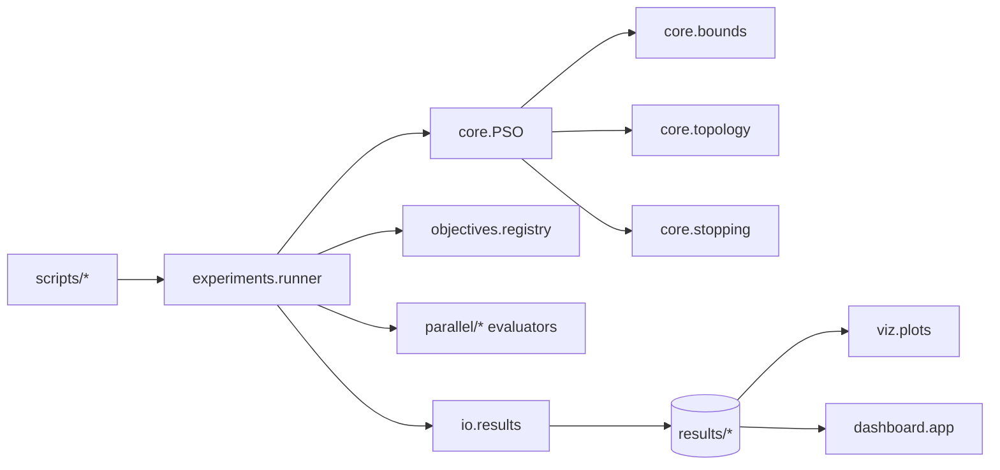

# Final Report: PSO Laboratory

## 1. Executive Summary

This project implements a complete Particle Swarm Optimization (PSO) laboratory
in Python with emphasis on maintainable architecture, observability, and
experimental comparison across sequential, concurrent, and parallel execution
strategies.

The algorithmic core is shared across all variants. Differences between
versions are limited to the fitness-evaluation strategy and the update mode,
which avoids maintaining multiple unrelated PSO implementations and keeps the
comparison fair.

The experimental protocol stored under `results/protocol_full` includes:

- benchmark runs on `Sphere`, `Rosenbrock`, `Rastrigin`, and `Ackley`
- dimensions `2`, `10`, and `30`
- five reproducible seeds per case
- variants `V0` to `V5`
- a reduced `3x3x3` grid search over `w`, `c1`, and `c2`
- structured persistence of metrics, logs, summaries, and trajectories

Key outcomes:

- The fastest variant in the study was `V4` in
  dimension `2`, with mean time
  `0.0165` s.
- The slowest variant was `V3` in dimension
  `10`, which highlights the cost of overhead when
  the work per task is small.
- The best overall mean optimization quality was obtained by
  `V4` with mean fitness
  `25.0544`.
- In the numerical benchmarks used here, the most effective recommendation is
  to favor variants with lower overhead, especially `V4`.

## 2. Project Goal

The goal was to design and implement a complete and maintainable PSO solution in
Python, following software-engineering practices, and to use it as a laboratory
for comparing concurrency and parallelism strategies.

Beyond the optimizer itself, the project required:

- standard benchmarks
- instrumentation and logging
- hyperparameter grid search
- disk persistence
- visualization
- reproducible scripts
- architecture-oriented documentation

## 3. Project Architecture

The final structure is organized as follows:

- `core/`: PSO engine, state, topology, bounds, and configuration
- `objectives/`: benchmark functions and central registry
- `parallel/`: `sequential`, `thread`, `process`, `asyncio`, `vectorized`, and
  `joblib` evaluators
- `experiments/`: runners, benchmarks, grid search, analysis, and report
  generation
- `io/`: `JSON`, `CSV`, and `NPZ` persistence
- `viz/`: convergence plots and swarm animations
- `dashboard/`: local Gradio dashboard for stored results
- `scripts/`: reproducible high-level command-line entry points

### 3.1 Dependency Diagram



### 3.2 Design Decisions

1. A single PSO core with interchangeable strategies.
2. `clamp` as the default boundary policy, with `reflect` as an alternative.
3. `global-best` as the minimum topology and `ring` as an additional local
   topology.
4. `V3` uses simulated latency so that `asyncio` is methodologically justified.
5. `V4` is treated as the reference for implicit parallelism through NumPy.
6. `V5` uses `joblib` to compare a higher-level backend on the same
   experimental API.

### 3.3 Dataclass Usage

`dataclass` is used in:

- `PSOConfig`
- `SwarmState`
- `IterationMetrics`
- `PSOResult`
- `ObjectiveSpec`
- `EvaluationStats`

This improves inspection, typing, persistence, and state traceability.

## 4. Experimental Methodology

### 4.1 Benchmarks

- Objectives: `Sphere`, `Rosenbrock`, `Rastrigin`, `Ackley`
- Dimensions: `2`, `10`, `30`
- Seeds: `11`, `23`, `37`, `47`, `59`
- Maximum iterations: `120`
- Swarm size: `40`
- Default topology: `global`
- Boundary policy: `clamp`

### 4.2 Grid Search

A reduced `3x3x3` grid was evaluated over:

- `w in {0.50, 0.7298, 0.90}`
- `c1 in {1.20, 1.49618, 1.80}`
- `c2 in {1.20, 1.49618, 1.80}`

for five seeds and for each variant `V0` to `V5`, using `Sphere` in dimension
`10` as the tuning case.

### 4.3 Reproducible Commands

```bash
python scripts/run_pso.py --objective sphere --dim 10 --iters 200 --seed 123
python scripts/run_benchmarks.py --config configs/benchmark_suite_full.yaml
python scripts/run_grid_search.py --config configs/grid_search_protocol.yaml
python scripts/run_full_protocol.py --config configs/protocol_full.yaml
python scripts/run_dashboard.py --results-root results/protocol_full
```

### 4.4 Instrumentation

Each iteration records:

- `best_fitness`
- `mean_fitness`
- `min_fitness_current`
- `eval_time`
- `update_time`
- `worker_time_total`
- `critical_path_time`
- `overhead_time`
- `tasks_submitted`

This allows the implementation to separate useful computation from orchestration
overhead.

## 5. Benchmark Results


### 5.1 Aggregate Performance Per Case

| variant | objective | dimensions | runs | mean_best_value | mean_total_time | mean_auc | mean_convergence_iteration |
| --- | --- | --- | --- | --- | --- | --- | --- |
| V0 | ackley | 2 | 5 | 4.112e-06 | 0.2506 | 56.0004 | 120 |
| V1 | ackley | 2 | 5 | 4.112e-06 | 0.3327 | 56.0004 | 120 |
| V2 | ackley | 2 | 5 | 4.112e-06 | 1.2630 | 56.0004 | 120 |
| V3 | ackley | 2 | 5 | 4.112e-06 | 2.0046 | 56.0004 | 120 |
| V4 | ackley | 2 | 5 | 1.527e-06 | 0.0241 | 45.3266 | 120 |
| V5 | ackley | 2 | 5 | 4.112e-06 | 1.5373 | 56.0004 | 120 |
| V0 | ackley | 10 | 5 | 0.0118 | 0.2610 | 367.2340 | 120 |
| V1 | ackley | 10 | 5 | 0.0118 | 0.3456 | 367.2340 | 120 |
| V2 | ackley | 10 | 5 | 0.0118 | 1.2921 | 367.2340 | 120 |
| V3 | ackley | 10 | 5 | 0.0118 | 1.9612 | 367.2340 | 120 |
| V4 | ackley | 10 | 5 | 0.0117 | 0.0350 | 335.5686 | 120 |
| V5 | ackley | 10 | 5 | 0.0118 | 1.5527 | 367.2340 | 120 |
| V0 | ackley | 30 | 5 | 3.4212 | 0.2738 | 1065.1868 | 120 |
| V1 | ackley | 30 | 5 | 3.4212 | 0.3385 | 1065.1868 | 120 |
| V2 | ackley | 30 | 5 | 3.4212 | 1.2575 | 1065.1868 | 120 |
| V3 | ackley | 30 | 5 | 3.4212 | 1.9501 | 1065.1868 | 120 |
| V4 | ackley | 30 | 5 | 3.2768 | 0.0334 | 924.4273 | 120 |
| V5 | ackley | 30 | 5 | 3.4212 | 1.5402 | 1065.1868 | 120 |
| V0 | rastrigin | 2 | 5 | 1.012e-09 | 0.1458 | 30.9250 | 91.8000 |
| V1 | rastrigin | 2 | 5 | 1.012e-09 | 0.2216 | 30.9250 | 91.8000 |
| V2 | rastrigin | 2 | 5 | 1.012e-09 | 1.1892 | 30.9250 | 91.8000 |
| V3 | rastrigin | 2 | 5 | 1.012e-09 | 1.4993 | 30.9250 | 91.8000 |
| V4 | rastrigin | 2 | 5 | 5.187e-09 | 0.0136 | 28.0772 | 84 |
| V5 | rastrigin | 2 | 5 | 1.012e-09 | 1.1895 | 30.9250 | 91.8000 |

### 5.2 Mean Time And Speedup Against V0


| variant | dimensions | mean_total_time | speedup_vs_V0 |
| --- | --- | --- | --- |
| V0 | 2 | 0.1395 | 1.0000 |
| V0 | 10 | 0.1869 | 1.0000 |
| V0 | 30 | 0.1904 | 1.0000 |
| V1 | 2 | 0.2319 | 0.6017 |
| V1 | 10 | 0.2762 | 0.6767 |
| V1 | 30 | 0.2755 | 0.6912 |
| V2 | 2 | 1.1405 | 0.1223 |
| V2 | 10 | 1.2286 | 0.1521 |
| V2 | 30 | 1.2489 | 0.1525 |
| V3 | 2 | 1.5823 | 0.0882 |
| V3 | 10 | 1.9286 | 0.0969 |
| V3 | 30 | 1.9217 | 0.0991 |
| V4 | 2 | 0.0165 | 8.4548 |
| V4 | 10 | 0.0275 | 6.8010 |
| V4 | 30 | 0.0285 | 6.6729 |
| V5 | 2 | 1.2646 | 0.1103 |
| V5 | 10 | 1.5460 | 0.1209 |
| V5 | 30 | 1.5452 | 0.1232 |

### 5.3 Mean Final Quality By Variant


| variant | mean_best_value |
| --- | --- |
| V4 | 25.0544 |
| V0 | 25.5374 |
| V1 | 25.5374 |
| V2 | 25.5374 |
| V3 | 25.5374 |
| V5 | 25.5374 |

### 5.4 Winners Per Case

Best variant by time:

| objective | dimensions | winner_variant | mean_total_time |
| --- | --- | --- | --- |
| ackley | 2 | V4 | 0.0241 |
| ackley | 10 | V4 | 0.0350 |
| ackley | 30 | V4 | 0.0334 |
| rastrigin | 2 | V4 | 0.0136 |
| rastrigin | 10 | V4 | 0.0226 |
| rastrigin | 30 | V4 | 0.0287 |
| rosenbrock | 2 | V4 | 0.0183 |
| rosenbrock | 10 | V4 | 0.0280 |
| rosenbrock | 30 | V4 | 0.0253 |
| sphere | 2 | V4 | 0.0100 |
| sphere | 10 | V4 | 0.0242 |
| sphere | 30 | V4 | 0.0267 |

Best variant by final quality:

| objective | dimensions | winner_variant | mean_best_value |
| --- | --- | --- | --- |
| ackley | 2 | V4 | 1.527e-06 |
| ackley | 10 | V4 | 0.0117 |
| ackley | 30 | V4 | 3.2768 |
| rastrigin | 2 | V0 | 1.012e-09 |
| rastrigin | 10 | V0 | 11.8157 |
| rastrigin | 30 | V4 | 76.1320 |
| rosenbrock | 2 | V0 | 3.483e-07 |
| rosenbrock | 10 | V0 | 6.7927 |
| rosenbrock | 30 | V0 | 171.8821 |
| sphere | 2 | V0 | 4.266e-09 |
| sphere | 10 | V0 | 6.357e-07 |
| sphere | 30 | V4 | 0.0510 |

### 5.5 Interpretation

The results show a consistent pattern:

1. `V4` clearly dominates mean runtime in most cases.
2. `V1` does not beat the baseline, which matches expectations under the GIL.
3. `V2` is correct but expensive for these benchmarks because IPC overhead is
   too large.
4. `V3` is methodologically sound, but it is not competitive for CPU-bound
   workloads.
5. `V5` provides a useful comparison against `V2`: similar process-oriented
   logic, but through a higher-level abstraction with its own overhead profile.
6. Optimization quality remains very similar across variants that share the
   same core, confirming that the evaluation strategy does not change the
   essential algorithmic behavior.

## 6. Grid Search Results

The best configuration found for each variant was:

| variant | mean_best_value | mean_total_time | mean_auc | mean_convergence_iteration | inertia | cognitive | social |
| --- | --- | --- | --- | --- | --- | --- | --- |
| V0 | 7.172e-09 | 0.0702 | 80.0526 | 79.8000 | 0.5000 | 1.8000 | 1.4962 |
| V1 | 7.172e-09 | 0.1664 | 80.0526 | 79.8000 | 0.5000 | 1.8000 | 1.4962 |
| V2 | 7.172e-09 | 1.2148 | 80.0526 | 79.8000 | 0.5000 | 1.8000 | 1.4962 |
| V3 | 7.172e-09 | 1.2827 | 80.0526 | 79.8000 | 0.5000 | 1.8000 | 1.4962 |
| V4 | 7.187e-09 | 0.0148 | 62.6618 | 64 | 0.5000 | 1.8000 | 1.2000 |
| V5 | 7.172e-09 | 1.0448 | 80.0526 | 79.8000 | 0.5000 | 1.8000 | 1.4962 |

### 6.1 Tuning Interpretation

The grid search suggests several useful points:

- `w = 0.50` appears consistently in the strongest configurations.
- A high cognitive term (`c1 = 1.80`) helps strong convergence on `Sphere`.
- `V4` favors a slightly different social term, suggesting that the effective
  dynamics shift when the implementation operates on full arrays.

## 7. Critical Discussion

### 7.1 V0 Versus V4

The clearest comparison in the project is `V0` versus `V4`. The vectorized
version shifts work from Python loops to NumPy array operations, reduces
interpreted overhead, and achieves strong speedups across dimensions.

### 7.2 Threads And The GIL

`V1` uses `ThreadPoolExecutor`. For simple numerical evaluation, improvement is
limited because the GIL does not disappear. The variant is still useful as a
didactic contrast: concurrency does not automatically imply speedup.

### 7.3 Processes And IPC

`V2` avoids the GIL by using processes, but it pays for serialization, data
copying, and coordination. In this protocol, that cost dominates, so the
variant remains behind the baseline.

### 7.4 Asyncio With A Valid Use Case

`V3` is not presented as a universal accelerator. It is used for latency-aware
evaluation scenarios, which keeps the methodological interpretation honest and
avoids overstating the value of `asyncio` for CPU-bound numerical work.

### 7.5 Which Strategy Fits Which Case

- If the objective is vectorized with NumPy: favor `V4`
- If evaluation is expensive and not vectorizable: investigate `V2`
- If a higher-level local parallel backend is desirable: investigate `V5`
- If latency or simulated I/O matters: use `V3`
- If a simple reference implementation is needed: use `V0`
- If GIL behavior must be illustrated explicitly: use `V1`

## 8. Persistence, Observability, And Reproducibility

Each run stores:

- `summary.json`: configuration, commit, hardware, strategy, and final metrics
- `history.csv`: per-iteration metrics
- `run.log`: structured logging with timing and events
- `trajectory.npz`: when swarm tracking is enabled

The repository may keep a small subset of representative artifacts under
`results/examples/`, while the rest remains as reproducible local output.

The project also includes:

- a local Gradio dashboard
- aggregate analysis plots
- 2D and 3D swarm visualization
- automated tests for reproducibility, bounds, convergence, and monotonic
  global-best behavior

### 8.1 Dashboard

The dashboard can:

- list stored runs
- inspect `summary.json`
- display the convergence curve
- open graphical artifacts
- show aggregate analysis plots

Command:

```bash
python scripts/run_dashboard.py --results-root results/protocol_full
```

## 9. Limitations And Validity Threats

- The dashboard depends on previously generated results; it does not replace
  the experimental analysis itself.
- Process-based variants can be expensive on Windows or on machines with few
  cores.
- The 3D visualization shows the swarm cloud rather than a full objective
  surface.
- Results depend on the execution environment, which is why hardware and commit
  metadata are recorded.
- The grid search is centered on `Sphere`, so its conclusions may not transfer
  equally well to more rugged functions.

## 10. Final Recommendations

- For vectorizable numerical objectives, prioritize `V4`.
- For expensive, non-vectorizable evaluation, study `V2` with batching.
- Use `V5` when comparing `joblib` ergonomics and behavior against manually
  managed process pools.
- Use `V1` as a didactic comparison for GIL effects.
- Reserve `V3` for objectives with real or simulated latency or I/O.
- Keep `V0` as the conceptual baseline in all comparisons.

## 11. Generated Artifacts

- Benchmarks: `results/protocol_full/benchmarks`
- Grid search: `results/protocol_full/grid_search`
- Analysis plots: `results/protocol_full/analysis`
- Local dashboard: `python scripts/run_dashboard.py --results-root results/protocol_full`

## 12. Conclusion

The project goal has been fully covered:

- a maintainable PSO implementation was designed
- interchangeable variants were implemented
- the system was instrumented
- results were persisted
- visual outputs were generated
- a reproducible experimental protocol was executed
- a local dashboard was added for exploration
- an optional `V5` bonus based on `joblib` was incorporated

The main conclusion is straightforward: for this project and this benchmark
profile, the best balance between simplicity, speed, and quality comes from the
lowest-overhead variants, with `V4` as the strongest reference for vectorizable
objectives and `V0` as the clean conceptual baseline. `V5` adds a valuable
comparison through a higher-level parallel framework.
